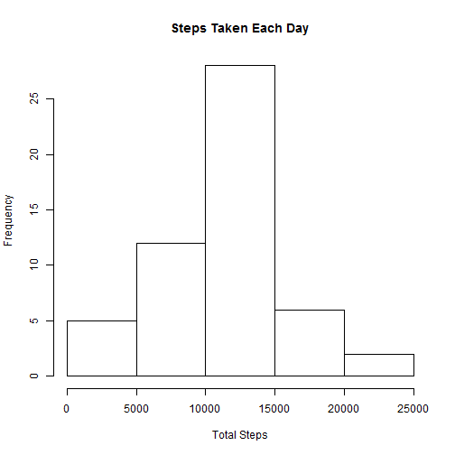
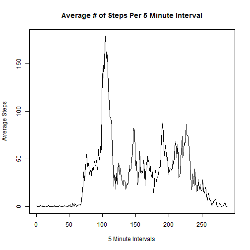
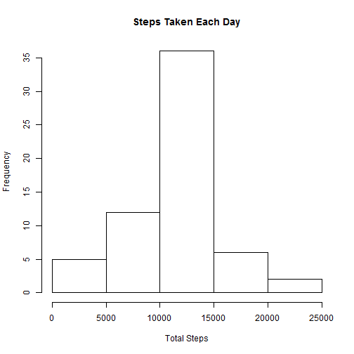
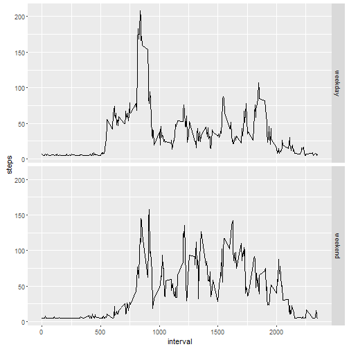

Assignment: Course Project 1
========================================================


```r
library(dplyr)
```

```
## 
## Attaching package: 'dplyr'
```

```
## The following objects are masked from 'package:stats':
## 
##     filter, lag
```

```
## The following objects are masked from 'package:base':
## 
##     intersect, setdiff, setequal, union
```

```r
library(ggplot2)
```

```
## Warning: package 'ggplot2' was built under R version 3.2.4
```

```r
library(data.table)
```

```
## data.table 1.9.6  For help type ?data.table or https://github.com/Rdatatable/data.table/wiki
```

```
## The fastest way to learn (by data.table authors): https://www.datacamp.com/courses/data-analysis-the-data-table-way
```

```
## 
## Attaching package: 'data.table'
```

```
## The following objects are masked from 'package:dplyr':
## 
##     between, last
```

```r
library(car)
```

```
## Warning: package 'car' was built under R version 3.2.5
```

```r
#Load and read file
activity  = read.csv("activity.csv")
```

## What is the mean of the total number of steps taken per day?

Sum steps for each day


```r
steps_by_day = rowsum(activity$steps, activity$date, na.rm = FALSE)
```

#### Histogram of the total steps taken each day


```r
hist(steps_by_day, main="Steps Taken Each Day", xlab="Total Steps")
```



Calculate the mean and median for steps taken each day


```r
steps_mean <- as.character(round(mean(steps_by_day, na.rm = TRUE),2))
steps_median <- as.character(round(median(steps_by_day, na.rm = TRUE),2))
```

The Mean steps each day is 10766.19.  
The Median steps each day is 10765.

### What is the average daily activity pattern?


```r
steps_per_int <- rowsum(activity$steps,activity$interval, na.rm = TRUE)

# Convert interval to integer
activity$interval <- as.integer(activity$interval)

#get counts of each 5 minute intervals
count_int <- nrow(filter(activity, interval == max(interval), rm.na = TRUE))

# Mean of the total steps per interval
steps_per_int <- data.table(steps_per_int)
colnames(steps_per_int) <- c("steps")
steps_per_int$mean <- steps_per_int$steps/count_int

# Plot the timeseries graph
plot(ts(steps_per_int$mean), type='l', main='Average # of Steps Per 5 Minute Interval', ylab='Average Steps', xlab='5 Minute Intervals')
```




```r
#Retrieve the interval with the highest average steps

activity2 = select(activity,steps, interval)
activity2 = aggregate(steps~interval,activity2, mean, rm.na = TRUE)
max_5_min = filter(activity2, steps == max(steps) )
max_5_min_int = max_5_min$interval
```

The 835 5-minute interval, on average across all the days in the dataset, contains the maximum number of steps.

## Imputing missing values


```r
# Get count of rows missing values
incomplete = activity[!complete.cases(activity),]
incomplete = nrow(incomplete)
```

The total number of rows with incomplete data is 2304

### Devise a strategy for filling in all of the missing values in the dataset. 
#### Create a new dataset that is equal to the original dataset but with the missing data filled in.


```r
complete_activity = activity

# Calculate the median of the mean per day
activity3 = select(activity,steps, date)
activity3 = aggregate(steps~date,activity3, mean, rm.na = TRUE)
med_of_meanpd = median(activity3$steps)

#Set steps with NA values to the m
complete_activity$steps[is.na(complete_activity$steps)] <- med_of_meanpd
```

### Make a histogram of the total number of steps taken each day


```r
adj_steps_by_day = rowsum(complete_activity$steps, complete_activity$date)

hist(adj_steps_by_day, main="Steps Taken Each Day", xlab="Total Steps")
```



### Calculate and report the mean and median total number of steps taken per day


```r
adj_steps_mean <- as.character(round(mean(adj_steps_by_day, na.rm = TRUE),2))
adj_steps_median <- as.character(round(median(adj_steps_by_day, na.rm = TRUE),2))
```

The Mean of the adjusted steps per day is 10766.03.   
The Median of the adjusted steps each day is 10765.

This varies only slightly from the unadjusted mean and median steps per day. 

# Are there differences in activity patterns between weekdays and weekends?


```r
# create day of the week variable
complete_activity = mutate(complete_activity, day_of_week = weekdays(as.Date(date,'%Y-%m-%d')))
# change dayof_week to 'weekend' or 'weekday'
complete_activity$day_of_week = recode(complete_activity$day_of_week, "c('Monday','Tuesday', 'Wednesday', 'Thursday', 'Friday')='weekday'")
complete_activity$day_of_week <- recode(complete_activity$day_of_week, "c('Saturday','Sunday')= 'weekend'")

#aggregate by weekend and weekday
complete_activity2 = aggregate(steps~interval+day_of_week,complete_activity, mean, rm.na = TRUE)

# Make a panel plot containing a time series plot 
ggplot(complete_activity2, aes(x=interval, y=steps)) + geom_line() + facet_grid(day_of_week ~ .)
```



